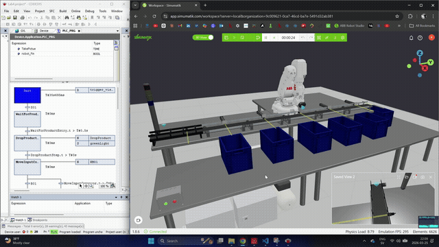

# Digital Twin–Based Vision System for Automated Object Sorting — ABB Robot, CodeSys PLC & Deep Learning

A digital twin of an automated object-sorting cell, integrating 3D simulation, ABB robot programming, PLC control logic, and a deep learning vision system into one coordinated automation pipeline. 

---

## Demo

An object travels along the conveyor to the inspection point, where a camera captures an image and a MobileNetV2 model classifies it in real time. The PLC receives the classification result over OPC UA and routes the object to its designated bin via the ABB robot or pneumatic cylinder depending on the drop point.



*(real-time, full-speed capture — object classes: apples, bottles, cars, cups, screwdrivers)*

---

## Overview

This project designs and evaluates a digital twin–based sorting system that mirrors a real industrial process entirely in simulation, combining a virtual production environment, a programmable logic controller (PLC), a computer vision system, and robotic manipulation:

1. An object is placed on the conveyor and moves toward the inspection point.
2. A photoelectric sensor detects the object's arrival and the PLC triggers image capture.
3. A camera positioned above the conveyor captures an image of the object.
4. A Python vision system (MobileNetV2) classifies the object into one of five classes: **apples, bottles, cars, cups, screwdrivers**.
5. The classification result is sent back to the PLC over OPC UA.
6. The PLC determines the sorting action and activates the pneumatic cylinder or the ABB robot, which picks and places the object into its designated bin.
7. A three-colour signal beacon reports system status throughout the cycle, and a reset routine handles fault conditions (e.g. an object removed from the conveyor mid-cycle).

The project also investigates the **reality gap** between virtual and real image data — evaluating classification/detection model performance under virtual-to-virtual, real-to-real, virtual-to-real, and mixed-to-real training/testing conditions.

---

## System Architecture

| Layer | Tool | Role |
|---|---|---|
| 3D Simulation | Simumatik | Digital twin of the physical cell — conveyor, photoelectric sensors, pneumatic cylinders, camera, ABB robot (IRB140) and controller, signal beacon, collection bins |
| PLC Logic | CodeSys (Sequential Function Chart) | Central coordination — product entry, image-capture triggering, sorting-step sequencing, signal beacon control, error detection & reset |
| AI Vision | Python + PyTorch (MobileNetV2) | Real-time object classification from the camera image |
| Robot Control | ABB RobotStudio | Path planning and pick-and-place motion program for the ABB IRB140, replacing a pneumatic actuator for one of the sorting stations |
| Communication | OPC UA | Real-time, bidirectional data exchange between CodeSys and the Python vision system |

All subsystems communicate over **OPC UA**, the industry-standard protocol for machine-to-machine communication in smart manufacturing.

---

## Simulation Environment — Simumatik

The cell — conveyor, photoelectric sensors, pneumatic cylinders, a camera positioned above the conveyor, an ABB IRB140 robot and controller, a signal beacon, and multiple collection bins — was modelled in Simumatik as the digital twin of the physical sorting system. The conveyor transports objects past a defined inspection point, where sensors trigger image acquisition. Five object classes are used: apples, bottles, cars, cups, and screwdrivers; the bottle model was custom-designed in Autodesk Inventor and imported into Simumatik.

The virtual setup allows controlled experimentation — consistent object positioning and repeatable testing conditions — and safe testing of system behaviour without physical hardware.

The Simumatik export is in [`simumatik/`](simumatik/).

---

## PLC Logic — CodeSys

The control logic is implemented in CodeSys as a step-based state machine responsible for coordinating the conveyor, sensors, and actuators. When an object reaches the inspection point, the PLC sets a trigger signal (`trigger_vision`) to initiate classification, then reads the result (`vision_result`) and drives the corresponding sorting step — a dedicated pneumatic actuator per object class, or the ABB robot for the sorting station it replaces.

**Error detection and handling** is built into the sequence: the signal beacon shows constant **green** during normal operation, **yellow** while an object is being moved into its bin (by cylinder or robot), and **red** if an object is removed from the conveyor unexpectedly. A reset button clears the fault and returns the system to normal operation.

The CodeSys project file is in [`codesys/`](codesys/).

---

## Robot Programming — RobotStudio & RAPID

An ABB IRB140 is programmed in RobotStudio to extend the system beyond conventional actuator-based sorting, performing pick-and-place operations for one of the sorting stations. The robot waits for a trigger signal from the PLC, then executes a `MoveL`-based motion sequence — approaching the object, closing the gripper, moving it above its bin, releasing, and retracting — before signalling completion back to the PLC. The executed motion is reflected within the Simumatik environment, keeping the control logic, robot execution, and digital twin synchronized.

The RobotStudio station and RAPID module are in [`robotstudio/`](robotstudio/).

---

## AI Vision System

The vision system is implemented in Python using **MobileNetV2** (PyTorch/torchvision) for object classification. On each trigger from the PLC, the system loads the image captured by the Simumatik camera, runs inference, and — if the prediction confidence clears a minimum threshold — maps the predicted class to a PLC result code and sends it back over OPC UA. Low-confidence predictions are reported as "unrecognized" so the PLC can route the object accordingly.

As part of the evaluation, both **MobileNetV2** and **ResNet18** were compared for classification, and **YOLOv8n** and **Faster R-CNN** (ResNet50-FPN backbone) were compared for object detection, across virtual-to-virtual, real-to-real, virtual-to-real, and mixed-to-real training/testing setups — to characterize the reality gap between models trained on simulated data and evaluated on real images.

The vision system source and trained weights are in [`vision-system/`](vision-system/).

---

## Communication — OPC UA Integration

Communication between the PLC and the vision system is achieved using **OPC UA** (Open Platform Communications Unified Architecture). The PLC acts as the central controller and the Python vision system as an external client. A trigger-based mechanism coordinates the two: when an object reaches the inspection point, the PLC sets `trigger_vision`; the vision system detects the change, classifies the image, and writes the result to `vision_result`; the PLC reads this value to decide the sorting action.

---

## Tech Stack

`Simumatik` · `ABB RobotStudio` · `RAPID` · `CodeSys (IEC 61131-3 SFC)` · `Python` · `PyTorch / MobileNetV2` · `OpenCV` · `OPC UA`

---

## Repository Structure

```
├── assets/                  # Demo GIF used in this README
│   └── demo-normal-speed.gif
├── robotstudio/              # ABB RobotStudio station and RAPID program
│   ├── station/
│   │   ├── Project3.rsstnx
│   │   └── MetaData.xml
│   └── rapid/
│       └── Module1.mod
├── codesys/                  # CodeSys project file (SFC logic)
│   └── Codesys.project
├── vision-system/            # Python vision classification script + trained weights
│   ├── vision.py
│   └── model/
│       └── best_mobilenetv2.pth
├── simumatik/                 # Simumatik exported project
│   └── Simumatik.xml
└── README.md
```

---

## Context

This project was developed for the **Virtual Intelligent Machines (VP711A)** course at the **University of Skövde**, exploring digital twin–based automation: designing and evaluating a simulated sorting cell that integrates a virtual environment, PLC control, computer vision, and robotic manipulation, with a particular focus on the performance gap between vision models trained on virtual versus real-world data.
